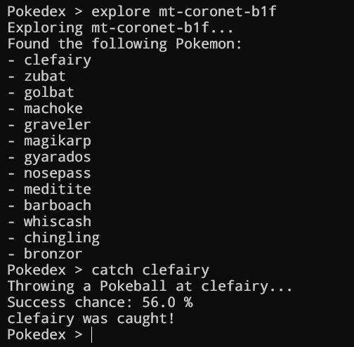

# PokedexCLI

A pokedex CLI, a [boot.dev](https://www.boot.dev/courses/build-pokedex-cli-golang) project

## Features

- Travel through locations of the world of Pokemon.
- Catch Pokemon!
- Save your progress to a file.

## Ideas

Here are some features that I might implement if I ever have the time to do it:

- Pokemon battles
- Random encounters when exploring a location
- Travel with a party of Pokemon
- Evolving Pokemon?
- Limit travel to make it more interesting.

